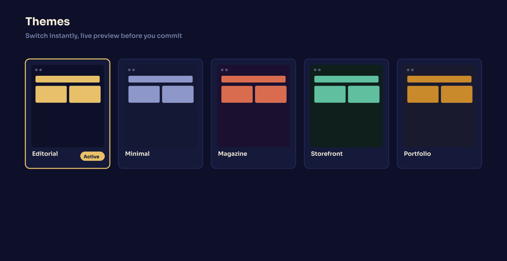
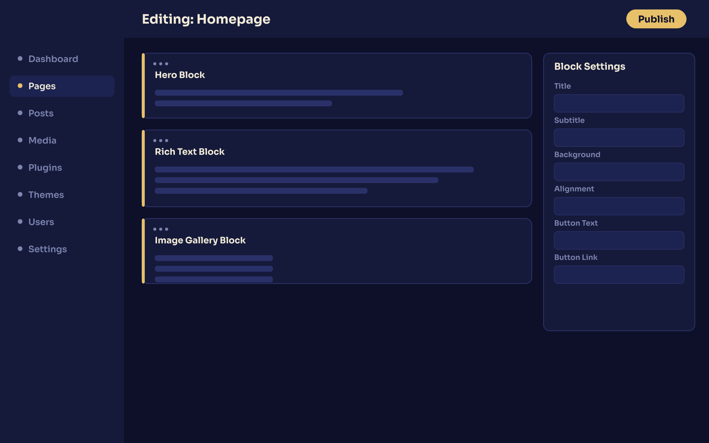

<p align="center">
  <picture>
    <source media="(prefers-color-scheme: dark)" srcset="assets/lockup-dark.png">
    
  </picture>
</p>

<h1 align="center">نخستین سیستم مدیریت محتوای پارسی (فارسی) رایگان و متن‌باز روی سرور شخصی شما.</h1>
<p align="center"><b>The first free, open-source Persian CMS on your own server.</b></p>

<p align="center">
  
</p>

یک CMS لاراول با فرانت‌اند Next.js که روی سرور خودتان اجرا می‌شود. ویرایشگر بصری بلوک،
اجراکنندهٔ واقعی پلاگین، قالب‌های قابل نصب، و فارسی از همان کامیت اول — نه یک فایل ترجمه
که بعداً به آن اضافه شده باشد.

[](LICENSE)
[](https://php.net)
[](https://nextjs.org)
[](https://postgresql.org)
[](https://en.wikipedia.org/wiki/Free_and_open-source_software)

**فارسی** · **[English / انگلیسی](README.md)**

> 🇬🇧 This guide is in Persian. The full English version is at
> [`README.md`](README.md).

---

## فهرست مطالب

- [نام پیشداد](#نام-پیشداد)
- [چرا پیشداد](#چرا-پیشداد)
- [رایگان و متن‌باز](#رایگان-و-متن‌باز)
- [امنیت](#امنیت)
- [معماری](#معماری)
- [سیستم پلاگین](#سیستم-پلاگین)
- [قالب‌ها](#قالب‌ها)
- [ویرایشگر بلوکی](#ویرایشگر-بلوکی)
- [سئوی داخلی](#سئوی-داخلی)
- [مقایسه](#مقایسه)
- [نصب](#نصب)
- [الزامات سرور](#الزامات-سرور)
- [توسعه محلی](#توسعه-محلی)
- [پرسش‌های پرتکرار](#پرسش‌های-پرتکرار)
- [لایسنس](#لایسنس)
- [مشارکت](#مشارکت)

---

## نام پیشداد

**پیشداد** از **پیشدادیان** آمده است؛ نخستین سلسلهٔ شاهنامه، شاهان افسانه‌ای پیش از
ساسانیان. داستان پرشین از آن‌ها شروع می‌شود و اسم پروژه هم از همان‌جا آمده.

---

## چرا پیشداد

در این فضا دو مدل قیمت‌گذاری رایج است و هر دو یک جور هزینه دارند.

پلتفرم اشتراکی راحتی می‌دهد و داده‌های شما را روی سرور خودش نگه می‌دارد. نصب روی
سرور اختصاصی کنترل می‌دهد و هزینهٔ افزونه، قالب و وصله‌های امنیتی را به شما منتقل
می‌کند. پیشداد در دستهٔ دوم است و تلاش می‌کند آن هزینه را بردارد.

| | پیشداد | پلتفرم اشتراکی | نصب روی سرور |
|---|:---:|:---:|:---:|
| بدون حساب کاربری و بدون ثبت‌نام | ✅ | ❌ نیاز به ثبت‌نام | ✅ |
| هزینهٔ ماهانه | **رایگان برای همیشه** | 💳 اشتراک | 💳 افزونه + قالب |
| داده روی سرور خودتان | ✅ | ❌ سرور فروشنده | ⚠️ هاست اشتراکی |
| اجراکنندهٔ پلاگین در هسته | ✅ | ⚠️ مارکت‌پلیس | ⚠️ معمولاً غایب |
| نصب قالب | ✅ | 💳 قالب پولی | ⚠️ آپلود دستی |
| ویرایشگر بصری بلوک | ✅ | ✅ | ⚠️ اغلب افزونهٔ پولی |
| ابزار سئو در هسته | ✅ | 💳 افزونهٔ پولی | ⚠️ دستی |
| RTL کامل، رابط فارسی، تاریخ جلالی | ✅ | ⚠️ ناقص | ⚠️ دستی |
| خروجی کامل، بدون قفل‌شدگی | ✅ | ❌ | ✅ |

---

## رایگان و متن‌باز

پیشداد رایگان است، نه نسخه‌ای رایگان از یک محصول پولی. کل هسته MIT است و روی سروری
اجرا می‌شود که در اختیار خودتان است. نه نسخهٔ حرفه‌ای دارد، نه محدودیت کاربر، نه
تله‌متری.

پلاگین‌ها و قالب‌هایی که نصب می‌کنید را خودتان انتخاب کرده‌اید، قبل از اجرا بررسی
می‌شوند، و روی سروری می‌مانند که کسی جز شما نمی‌بیندش.

---

## امنیت

**هیچ‌چیز قبل از تأیید اجرا نمی‌شود.** پلاگین یک بستهٔ PHP است که می‌خواهد داخل سرور
شما اجرا شود. بیشتر سیستم‌ها اول نصب می‌کنند و بعد می‌فهمند چه بوده. پیشداد اول
بررسی می‌کند.

| چه چیزی | کجا |
|---|---|
| هر بسته با Ed25519 امضا می‌شود | `sodium_crypto_sign_detached` / `sodium_crypto_sign_verify_detached` در `PluginSignatureVerifier` |
| مانیفست پیش از امضا کانونی می‌شود، پس محتوای امضاشده بعداً قابل جایگزینی نیست | `canonical()` و `sortRecursive()` |
| کلید یا کریژنی که داخل بسته جا گرفته شناسایی و نصب رد می‌شود | `findSecretKeys()` در `PluginPackageValidator` |
| پلاگین نمی‌تواند نقطهٔ افزونهٔ دیگری را Claim کند؛ مسیر ارتقای سطح دسترسی بسته می‌شود | `slugBoundChecks()` |
| کلید اختصاصی برای هر پلاگین، قابل دور انداختن هنگام حذف | `ensureSealKey()` و `forgetSealKeyFor()` در `PluginTrustStore` |
| رد کردن بسته با دلیل و شناسهٔ کلید ثبت می‌شود | `plugin.package_rejected` |
| اسکن کریژن روی خود مخزن | secret scanning و push protection در گیت‌هاب روشن است |
| ورود دومرحله‌ای و نقش‌های namespaced | `google2fa` و `spatie/laravel-permission` |

پرمیشن‌های پلاگین با الگوی `plugin:{slug}:{module}.{action}` نام‌گذاری می‌شوند، پس
ماژول یک پلاگین هرگز با ماژول هسته یا ماژول پلاگین دیگر برخورد نمی‌کند.

دربارهٔ سابقهٔ هک حرفی نمی‌زنیم. حرف ما معماری است: کد پلاگین ورودی بی‌اعتماد است و باید
اجازهٔ اجرا را به دست بیاورد. کدش در `app/Services/Plugins/` است.

---

## معماری

```
                      ┌───────────────────────────────────┐
    مرورگر  ─────────▶ │  Next.js 15  (React 19, App Router) │
                      │  RTL · وزیرمتن · cacheHandler      │
                      └────────────────┬──────────────────┘
                                       │ کلاینت تایپ‌شده، تولیدشده
                                       │ از روی OpenAPI 3.1
                                       ▼
                      ┌───────────────────────────────────┐
                      │  Laravel 11   (فقط API)           │
                      │  Sanctum · RBAC · 2FA              │
                      │  اجراکنندهٔ پلاگین (Ed25519)        │
                      └──┬───────────┬───────────┬─────────┘
                         ▼           ▼           ▼
                   PostgreSQL     Redis      MinIO (S3)
```

| لایه | فناوری |
|---|---|
| بک‌اند | Laravel `^11.31` · PHP `≥8.2` · Sanctum · `spatie/laravel-permission` · `pragmarx/google2fa` · `morilog/jalali` |
| فرانت‌اند | Next.js `^15.5` · React `19` · TypeScript `5.7` · `@dnd-kit` · `jodit-react` · `jalaali-js` |
| داده | PostgreSQL `≥14` (مرتب‌سازی `fa-IR`) · Redis `≥6` · MinIO (سازگار با S3) |
| اجرا | Nginx · PHP-FPM · Composer 2 · Node.js `≥20` |
| API | OpenAPI 3.1، **۱۳۵ مسیر**، تایپ‌های کلاینت در فرانت تولید می‌شود |
| تست | PHPUnit — **۴۸۹ تست در ۶۷ فایل** (۶۳ Feature، ۳ Unit) |
| دارایی‌ها | کاملاً محلی. فونت و آیکون بدون CDN خارجی |

---

## سیستم پلاگین

پلاگین‌ها اعلانی هستند. یک `manifest.json` تحویل می‌دهید و هسته خودش مسیرها،
پرمیشن‌ها، ویجت‌ها، انواع صفحه و فرم تنظیمات را درمی‌آورد. شما قابلیت را می‌نویسید،
نه کد ثبت آن را.

```jsonc
{
  "permissions": [
    { "module": "blog", "title_fa": "بلاگ", "actions": ["view", "edit", "delete"] }
  ],
  "widgets": {
    "header": {
      "promo": {
        "title": "بنر تخفیف",
        "description": "نوار تخفیف بالای هدر.",
        "schema": { "type": "object", "properties": { "text": { "type": "string" } } },
        "ui": { "labels": { "text": "متن بنر" } }
      }
    }
  },
  "page_types": { "faq": { "title": "سوالات پرتکرار" } }
}
```

| هوک | چه چیزی می‌گیرید |
|---|---|
| `permissions` | ماژول دسترسی جدید در ماتریس نقش‌ها، با نام `plugin:{slug}:{module}.{action}` |
| `widgets` | ویجت جدید در هدر یا فوتر، با فرم تنظیم ساخته‌شده از روی JSON Schema |
| `page_types` | نوع صفحه و تب بلوک جدید در ویرایشگر، همراه با بلوک‌های پیش‌فرض |

هر سه هوک اختیاری‌اند، پس پلاگینی که فقط یکی را لازم دارد لازم نیست بقیه را اعلام کند.
خاموش کردن پلاگین، آن را از ماتریس نقش‌ها، پالت ویجت و تب‌های بلوک برمی‌دارد و دادهٔ
ذخیره‌شده‌اش را دست‌نخورده می‌گذارد.

قرارداد کامل: [`docs/PLUGIN-MANIFEST-CONTRACT.md`](docs/PLUGIN-MANIFEST-CONTRACT.md)
· راهنمای کامل: [`docs/PLUGIN-GUIDE.md`](docs/PLUGIN-GUIDE.md)

---

## قالب‌ها

قالب‌ها هم بسته‌هایی با همان مسیر نصب پلاگین هستند. هر قالب چیدمان، ویجت‌های هدر و
فوتر و بلوک‌های پیش‌فرض خودش را دارد و از داخل پنل نصب می‌شود، نه با کپی فایل.

پنج جهت بصری در هسته هست و هرکدام در لحظه، با پیش‌نمایش زنده قبل از تأیید، قابل تعویض
است. بدون بیلد مجدد، بدون دیپلوی مجدد.


*موکاپ برای نمایش مفهوم — بعداً با اسکرین‌شات یا GIF واقعی جایگزین شود.*

---

## ویرایشگر بلوکی

صفحه‌ها از بلوک‌های تایپ‌شده ساخته می‌شوند، نه از قالب.


*موکاپ برای نمایش مفهوم — بعداً با اسکرین‌شات یا GIF واقعی جایگزین شود.*

- مرتب‌سازی با کشیدن و رها کردن، از طریق `@dnd-kit`
- متن غنی با Jodit، و fallback به JSON تا بلوک ناشناس به‌جای حذف شدن، ضعیف‌تر رندر شود
- پیش‌نویس، بعد نسخه، بعد انتشار، با یک اشاره‌گر واحد `published_revision_id`
- انتخاب‌گر رسانه روی S3 یا MinIO
- هدر، فوتر و ستون‌بندی بدون دست‌زدن به کد

---

## سئوی داخلی

ابزار سئو بخشی از هسته است، نه افزونه‌ای که باید بخری.

- `sitemap.xml` و `robots.txt` مستقیم از مسیرهای اپ
- `llms.txt`، توصیف ماشین‌خوان سایت برای خزنده‌های هوش مصنوعی
- یک مسیر جستجوی درون‌سایتی
- قرارداد OpenAPI 3.1، تایپ‌شده از سر تا ته
- بدون منشأ اسکریپت شخص ثالث، یعنی بدون جریمهٔ اسکریپت شخص ثالث

---

## مقایسه

پیشداد روی ۱۶ معیار با WordPress و Django + Wagtail سنجیده شده، و سطرهایی که پیشداد
در آن‌ها نمرهٔ پایین می‌گیرد هم نگه داشته شده‌اند، نه حذف.

قبل از هر تصمیمی بخوانید: **[COMPARISON.fa.md](COMPARISON.fa.md)** ·
**[English comparison](COMPARISON.md)**

---

## نصب

```bash
git clone https://github.com/ArmanOskouei/Pishdad.git
cd Pishdad/cms-core

# --- بک‌اند ---
cd backend
cp .env.example .env
composer install
php artisan key:generate
php artisan migrate

# --- فرانت‌اند ---
cd ../frontend
npm install
npm run build
```

Nginx را به `public/` بک‌اند و `.next/` فرانت‌اند اشاره دهید و سایت بالاست.

---

## الزامات سرور

| | حداقل | پیشنهادی |
|---|---|---|
| سیستم‌عامل | Ubuntu 22.04 LTS | Ubuntu 24.04 LTS |
| CPU | ۲ هسته | ۴ هسته |
| RAM | ۲ گیگ | ۴ گیگ |
| دیسک | ۲۰ گیگ SSD | ۴۰ گیگ SSD |
| دامنه | ۱ دامنه با DNS به سرور | + ۱ زیردامنه |

<details>
<summary>نصب‌کننده چه چیزهایی را خودکار نصب می‌کند</summary>

| سرویس | نسخه |
|---|---|
| PHP | 8.3 (FPM) |
| افزونه‌های PHP | `pdo_pgsql` · `redis` · `sodium` · `intl` · `bcmath` · `mbstring` · `zip` · `gd` · `fileinfo` · `curl` · `openssl` |
| Nginx | 1.27+ |
| PostgreSQL | 14+ با مرتب‌سازی `fa-IR` |
| Redis | 6+ |
| MinIO | آخرین نسخه، ذخیره‌سازی شیء سازگار با S3 |
| Composer | 2.x |
| Node.js | 20 LTS، ۲۲ پیشنهاد می‌شود |
| TLS | گواهی خودکار و تمدید خودکار |

</details>

---

## توسعه محلی

```bash
# بک‌اند — http://127.0.0.1:8000
cd cms-core/backend
cp .env.example .env && composer install && php artisan serve

# فرانت‌اند — http://127.0.0.1:3000
cd cms-core/frontend
npm install && npm run dev
```

با Docker Compose، مجموعهٔ Nginx، PHP-FPM، PostgreSQL، Redis و MinIO بالا می‌آید:

```bash
cd cms-core/backend  && docker compose up -d
cd cms-core/frontend && docker compose up -d
```

| فرانت‌اند | |
|---|---|
| `npm run dev` | سرور توسعه |
| `npm run build` | بیلد production |
| `npm run typecheck` | بررسی تایپ |
| `npm run gen:types` | تولید تایپ‌های API از قرارداد OpenAPI |

| بک‌اند | |
|---|---|
| `php artisan test` | اجرای تست‌ها |
| `php artisan serve` | سرور توسعه |
| `composer run dev` | سرور، صف، لاگ و Vite با هم |

---

## پرسش‌های پرتکرار

**آیا پیشداد واقعاً رایگان است؟**
هسته با مجوز MIT منتشر می‌شود. نه نسخهٔ حرفه‌ای دارد، نه محدودیت کاربر، نه تله‌متری.
هزینهٔ شما فقط سرور است.

**برای فارسی و راست‌به‌چپ به افزونه نیاز دارم؟**
نه. راست‌به‌چپ روی CSS logical properties در تمام پروژه اجرا می‌شود، تاریخ جلالی هم در
بک‌اند و هم در فرانت‌اند هست، و رابط پنل از ابتدا فارسی است.

**پلاگین‌ها چطور قبل از اجرا بررسی می‌شوند؟**
هر بسته با Ed25519 امضا می‌شود. Trust Store پیش از بارگذاری حتی یک خط از کد پلاگین،
امضا را بررسی می‌کند، بسته‌های دارای کلید را رد می‌کند، و پلاگین نمی‌تواند نقطهٔ افزونهٔ
دیگری را ادعا کند. رد شدن‌ها با دلیل و شناسهٔ کلید ثبت می‌شود. [`SECURITY.md`](SECURITY.md)
را ببینید.

**برای اپ موبایل هم API دارد؟**
بک‌اند فقط API است و ۱۳۵ مسیر دارد که در یک قرارداد OpenAPI 3.1 تعریف شده و تایپ کلاینت
در فرانت‌اند تولید می‌شود. همان چیزی است که یک کلاینت موبایل استفاده می‌کند.

**برای اجرا چه چیزی لازم دارد؟**
یک سرور که در اختیار خودتان باشد. Ubuntu 22.04 یا 24.04، دو هسته، دو گیگ رم و بیست
گیگ دیسک برای یک سایت کوچک کافی است. فهرست کامل در
[الزامات سرور](#الزامات-سرور) است.

**می‌توانم محتوایم را با خودم ببرم؟**
بله. PostgreSQL متعلق به خودتان است و اسکیما ساده است، پس یک `pg_dump` تمام
خروجی است.

---

## لایسنس

MIT. [LICENSE](LICENSE)

## قدردانی

- **پیشداد**، نام‌گرفته از پیشدادیان، نخستین سلسلهٔ شاهنامه.
- **وزیرمتن**، قلم فارسی.
- ساخته‌شده روی Laravel، Next.js، PostgreSQL، Redis و MinIO.

## مشارکت

مشارکت شما خوش‌آمد است. لطفاً قبل از Pull Request یک Issue باز کنید تا اول دربارهٔ
مسیر صحبت کنیم.
